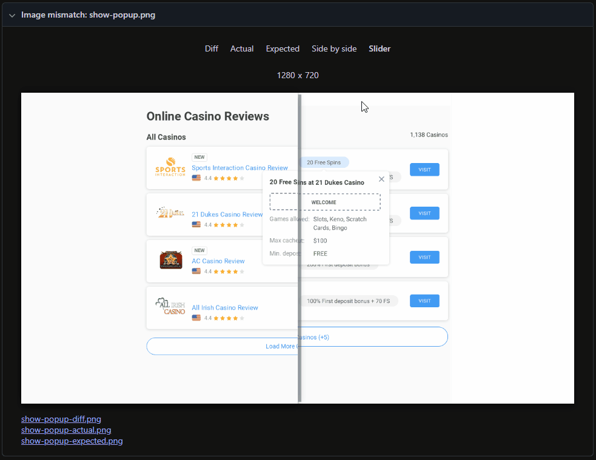

# Casino Reviews Page

* [Info](#info)
* [Design](#design)
* [Implementation](#implementation)
	+ [Demo gifs](#demo-gifs)
	+ [Code links](#code-links)
	+ [Playwright gifs](#playwright-gifs)

## Info

Following the links, the dev will find the Adobe XD Prototype and SPECS file for Desktop only. The final outcome of this test should be a web page, pixel perfect to our design and with some functionalities as described in the Prototype (Load More, popup, copy-code) with mobile adaptive markup.

By clicking anywhere in the prototype you can observe some zones that highlight. That means that if you click on them there is a functionality that must be replicated.

Please complete this task using only pure HTML, CSS, and JavaScript, without the use of any external libraries or frameworks. The final result should be uploaded to GitHub or GitLab, with a link provided that allows us to directly view the rendered layout. Make sure the link leads us to a live view of your work (not just the repository or a file download)

## Design

**(I removed actual links, for the safety reasons)**

Prototype: https://xd.adobe.com/view/XXXXXX-XXXXXXX

Specs: https://xd.adobe.com/view/XXXXXX-XXXXXXX

## Implementation

### Demo gifs:

Desktop version:

Mobile version:

Live version is here 

https://llamerr-demo-projects.github.io/casino-reviews/casino-reviews.html

### Code links:

JS entry point is here
[casino-reviews.js](https://github.com/llamerr-demo-projects/casino-reviews/blob/main/public/casino-reviews.js)

Basic template
[casino-reviews.html](https://github.com/llamerr-demo-projects/casino-reviews/blob/main/public/casino-reviews.html)

Styles entry point is here (I'm using scss and css @layers)
[casino-reviews.scss](https://github.com/llamerr-demo-projects/casino-reviews/blob/main/public/casino-reviews.scss)

If you want pure css, it's here
[casino-reviews.css](https://github.com/llamerr-demo-projects/casino-reviews/blob/main/public/casino-reviews.css)

I added some components (and their styles) here. Did not bother with making js classes.

- [casino-card](https://github.com/llamerr-demo-projects/casino-reviews/tree/main/public/components/casino-card)

- [dialog](https://github.com/llamerr-demo-projects/casino-reviews/tree/main/public/components/dialog)

- [skeleton](https://github.com/llamerr-demo-projects/casino-reviews/tree/main/public/components/skeleton)

### Playwright gifs:

Running playwright tests to match design to result screenshot:

Initial page:

Show popup:

Code copied:

